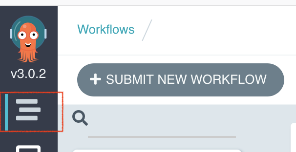
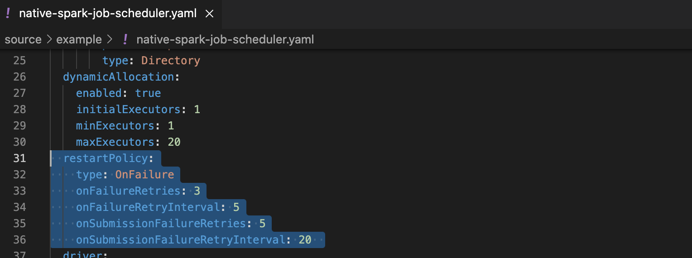

# SQL-based ETL with Spark on EKS
A project for a solution - SQL based ETL with a declarative framework powered by Apache Spark. 

## Spark on EKS Overview


### Submit ETL job in k8s


#### Table of Contents
* [Prerequisites](#Prerequisites) 
* [Deploy CFN](#Deploy-CFN)
* [Customization](#Customization)
* [Post Deployment](#Post-Deployment)
  * [Install command tool](#Install-command-tool)
  * [Test job in Jupyter notebook](#test-job-in-Jupyter-notebook)
  * [Submit job on Argo UI](#Submit-job-on-argo-ui)
  * [Submit job via Argo CLI](#Submit-job-via-argo-cli)
  * [Submit a native Spark job](#Submit-a-native-Spark-job-with-Spark-Operator)
    * [Execute a PySpark job](#Execute-a-PySpark-job)
    * [Self-recovery test](#Self-recovery-test)
    * [Cost savings with spot instance](#Check-Spot-instance-usage-and-cost-savings)
    * [Auto scaling & Dynamic resource allocation](#Autoscaling---dynamic-allocation-support)
* [Useful Commands](#Useful-Commands)  
* [Clean Up](#clean-up)

## Prerequisites 

* [AWS CloudShell](https://console.aws.amazon.com/cloudshell/) is available in your deployment **region**. Otherwise, use your computer to run commands.
* The project is downloaded either to your AWS Cloudshell console or your computer.
```bash
git clone https://github.com/aws-samples/sql-based-etl-on-amazon-eks.git
cd sql-based-etl-on-amazon-eks
```

## Deploy CFN

**Deployment Time**: about 30 minutes

  |   Region  |   Launch Template |
  |  ---------------------------   |   -----------------------  |
  |  ---------------------------   |   -----------------------  |
  **US East (N. Virginia)**| [](https://console.aws.amazon.com/cloudformation/home?region=us-east-1#/stacks/quickcreate?stackName=SparkOnEKS&templateURL=https://blogpost-sparkoneks-us-east-1.s3.amazonaws.com/blog/v2.0.0/SparkOnEKS.template) 

* Option1: Deploy with default (recommended). Check out the **Customization** session to deploy in a different region. 

* Option2: Fill in the parameter `jhubuser` if use your choice of username to login JupyterHub.
 
* Option3: If ETL your own data, input the parameter `datalakebucket` with your S3 bucket. 
`NOTE: the S3 bucket must be in the same region as the deployment region.`

## Customization

Build your own solution on top of the project, for example reconfigure the Jupyter notebook, or regenerate the CloudFormation for your region: 
```bash
export BUCKET_NAME_PREFIX=<your_bucket_name> # bucket where customized code will reside
export AWS_REGION=<your_region>
export SOLUTION_NAME=blog
export VERSION=v1.0.0 # version number for the customized code

# go to the project directory
cd spark-on-eks
./deployment/build-s3-dist.sh $BUCKET_NAME_PREFIX $SOLUTION_NAME $VERSION

# create the bucket where customized code will reside
aws s3 mb s3://$BUCKET_NAME_PREFIX-$AWS_REGION --region $AWS_REGION

# Upload deployment assets to the S3 bucket
aws s3 cp ./deployment/global-s3-assets/ s3://$BUCKET_NAME_PREFIX-$AWS_REGION/$SOLUTION_NAME/$VERSION/ --recursive --acl bucket-owner-full-control
aws s3 cp ./deployment/regional-s3-assets/ s3://$BUCKET_NAME_PREFIX-$AWS_REGION/$SOLUTION_NAME/$VERSION/ --recursive --acl bucket-owner-full-control

echo -e "\nIn web browser, paste the URL to launch the template: https://console.aws.amazon.com/cloudformation/home?region=$AWS_REGION#/stacks/quickcreate?stackName=SparkOnEKS&templateURL=https://$BUCKET_NAME_PREFIX-$AWS_REGION.s3.amazonaws.com/$SOLUTION_NAME/$VERSION/SparkOnEKS.template"
```

[*^ back to top*](#Table-of-Contents)
## Post-deployment

### Install command tool
```bash
cd spark-on-eks
./deployment/post-deployment.sh
```

[*^ back to top*](#Table-of-Contents)
### Test job in Jupyter notebook
1. Login with the details from the above script output. Or look up from the [Secrets Manager console](https://console.aws.amazon.com/secretsmanager/). 

Use the default server size unless your workload requires more powerful compute.

NOTE: Following the best seucrity practice, the notebook session refreshes every 30 minutes. Login again if that happens. You may lose your work if it hasn't been saved on time. The notebook allows you to download files, and is configurable, ie. you can disable it in order to improve your data security.

2. Open a sample job `spark-on-eks/source/example/notebook/scd2-job.ipynb` from your notebook instance. Click a `refresh` button if can't see the file. The job outputs a table to support the [Slowly Changing Dimension Type 2](https://www.datawarehouse4u.info/SCD-Slowly-Changing-Dimensions.html) business need.

3. [FYI] The source [contacts data](/deployment/app_code/data/) was generated by a [python script](https://raw.githubusercontent.com/cartershanklin/hive-scd-examples/master/merge_data/generate.py), stored in [deployment/app_code/data/](deployment/app_code/data/)


4. Execute each block and observe the result. You will get a hands-on experience on how the SQL-based ETL job works powered by Apache SparkSQL.

5. [FYI] To demonstrate the best practice in Data DevOps, the JupyterHub is configured to synchronize the latest code from a github repo. In real practice, you must save all changes to a source repository, in order to save and trigger your ETL pipelines.

6. Run a query in [Athena console](https://console.aws.amazon.com/athena/) to see if it is a SCD2 type table. 
```bash
SELECT * FROM default.deltalake_contact_jhub WHERE id=12
```

[*^ back to top*](#Table-of-Contents)
### Submit job on Argo UI

1. Check your connection in [AWS CloudShell](https://console.aws.amazon.com/cloudshell/) or on a local computer. If no access to EKS or no argoCLI installed, run the [post-deployment script](#run-a-script) again.
```bash
kubectl get svc && argo version --short
```
2. Login to Argo website. The authentication token refreshes every 10mins (configurable). Run the script again if timeout.
```bash
# use your CFN stack name if it is different
ARGO_URL=$(aws cloudformation describe-stacks --stack-name SparkOnEKS --query "Stacks[0].Outputs[?OutputKey=='ARGOURL'].OutputValue" --output text)
LOGIN=$(argo auth token)
echo -e "\nArgo website:\n$ARGO_URL\n" && echo -e "Login token:\n$LOGIN\n"
```
3. Click on the `Workflows` side menu then `SUBMIT NEW WORKFLOW` button. 

4. Go to `Edit using full workflow options`, and replace the content by the followings. Finally, click `CREATE`. Select a pod (dot) to check the job status and application logs.

  ```yaml
  apiVersion: argoproj.io/v1alpha1
  kind: Workflow
  metadata:
    generateName: nyctaxi-job-
    namespace: spark
  spec:
    serviceAccountName: arcjob
    entrypoint: nyctaxi
    templates:
    - name: nyctaxi
      dag:
        tasks:
          - name: step1-query
            templateRef:
              name: spark-template
              template: sparkLocal  
            arguments:
              parameters:
              - name: jobId
                value: nyctaxi  
              - name: tags
                value: "project=sqlbasedetl, owner=myowner, costcenter=66666"  
              - name: configUri
                value: https://raw.githubusercontent.com/tripl-ai/arc-starter/master/examples/kubernetes/nyctaxi.ipynb
              - name: parameters
                value: "--ETL_CONF_DATA_URL=s3a://nyc-tlc/trip*data \
                --ETL_CONF_JOB_URL=https://raw.githubusercontent.com/tripl-ai/arc-starter/master/examples/kubernetes"
  ```
  
  
[*^ back to top*](#Table-of-Contents)
### Submit job via Argo CLI

To demonstrate Argo's orchestration advantage with a job dependency feature, the single notebook was broken down into 3 files, ie. 3 ETL jobs, stored in [deployment/app_code/job/](deployment/app_code/job). It only takes about 5 minutes to complete all jobs.

1. Make sure you are at the right directory, ie. in `spark-on-eks`. 
2. Submit the job and check the progress in Argo web console.
```bash
# change to your CFN stack name if it is different
app_code_bucket=$(aws cloudformation describe-stacks --stack-name SparkOnEKS --query "Stacks[0].Outputs[?OutputKey=='CODEBUCKET'].OutputValue" --output text)
argo submit source/example/scd2-job-scheduler.yaml -n spark --watch -p codeBucket=$app_code_bucket
```


3. Query the table in [Athena](https://console.aws.amazon.com/athena/) to see if it has the same outcome as the test in Jupyter earlier. 

```sql
SELECT * FROM default.contact_snapshot WHERE id=12
``` 

[*^ back to top*](#Table-of-Contents)
### Submit a native Spark job with Spark Operator

Previously, we have run the CloudFormation-like ETL job defined in Jupyter notebook. They are powered by the [Arc data framework](https://arc.tripl.ai/). It significantly simplifies and accelerates the Spark application development with zero line of code. 

In this example, we will reuse the Arc docker image, because it contains the latest Spark distribution. Let's run a native Spark job that is defined by k8s's CRD [Spark Operator](https://operatorhub.io/operator/spark-gcp). It saves efforts on DevOps operation, as the way of deploying Spark application follows the same declarative approach in k8s. It is consistent with other business applications CICD deployment processes.
  The example demonstrates:
  * Save cost with [Amazon EC2 Spot instance](https://aws.amazon.com/ec2/spot/) type
  * Dynamically scale a Spark application - via [Dynamic Resource Allocation](https://spark.apache.org/docs/3.0.0-preview/job-scheduling.html#dynamic-resource-allocation)
  * Self-recovery after losing a Spark driver
  * Monitor a job on Spark WebUI

[*^ back to top*](#Table-of-Contents)
#### Execute a PySpark job

Submit a PySpark job [deployment/app_code/job/wordcount.py](deployment/app_code/job/wordcount.py) to EKS as usual.
```bash
# get an s3 bucket from CFN output
app_code_bucket=$(aws cloudformation describe-stacks --stack-name SparkOnEKS --query "Stacks[0].Outputs[?OutputKey=='CODEBUCKET'].OutputValue" --output text)

kubectl create -n spark configmap special-config --from-literal=codeBucket=$app_code_bucket
kubectl apply -f source/example/native-spark-job-scheduler.yaml
```
Check job progress:
```bash
kubectl get pod -n spark
# watch progress on SparkUI
# only works if submit the job from a local computer
kubectl port-forward word-count-driver 4040:4040 -n spark
# go to `localhost:4040` from your web browser
```
Run the job again if necessary:
```bash
kubectl delete -f source/example/native-spark-job-scheduler.yaml
kubectl apply -f source/example/native-spark-job-scheduler.yaml
```

[*^ back to top*](#Table-of-Contents)
#### Self-recovery test
In Spark world, we know the driver is a single point of failure of a Spark application. If driver dies, all other linked components will be discarded too. Outside of Kubernetes, it requires extra effort to set up a job rerun, in order to provide the fault tolerance capability. However, it is much simpler in Amazon EKS. Just few lines of retry definition without coding.



The pySpark job takes approx. 10 minutes to finish. Let's test the self-recovery against the active Spark cluster.

1. Driver test - manually kill the EC2 instance running your Spark driver:
```bash
# find the EC2 name, replace the placeholder below
kubectl describe pod word-count-driver -n spark
```
```bash
kubectl delete node <ec2_host_name>
# has the driver come back?
kubectl get pod -n spark
```
See the demonstration simulating a Spot interruption scenario: 


2. Executor test - when all executors' status is running, kill one of them: 
```bash
exec_name=$(kubectl get pod -n spark | grep "exec-1" | awk '{print $1}')
kubectl delete -n spark pod $exec_name --force
# has it come back with a different number suffix? 
kubectl get pod -n spark
```

[*^ back to top*](#Table-of-Contents)
#### Check Spot instance usage and cost savings
Go to [Spot Request console](https://console.aws.amazon.com/ec2sp/v2/) -> Saving Summary, to find out how much running cost you just saved.

#### Autoscaling & Dynamic Allocation support

The job ends up with 20 Spark executors/pods on 7 spot EC2 instances, approx. 3 executors per EC2 spot instance. It takes 10 minutes to complete. 

Once the job starts, you will see the scaling is triggered instantly. It creates a Spark cluster from 0 to 10 executors. Eventually, it lands to 20 executors, driven by the Dynamic Resource Allocation feature in Spark.

The auto-scaling is configured to be balanced across two AZs.
```bash
kubectl get node --label-columns=eks.amazonaws.com/capacityType,topology.kubernetes.io/zone
kubectl get pod -n spark
```


If you are concerned about the job performance, simply fit it into a single AZ by adding the Spark Config to the job submit: 
```yaml
--conf spark.kubernetes.node.selector.topology.kubernetes.io/zone=<availability zone>
```

[*^ back to top*](#Table-of-Contents)
## Useful Commands
 * `argo submit source/example/nyctaxi-job-scheduler.yaml`  submit a spark job via Argo
 * `argo list --all-namespaces`                       show all jobs scheduled via Argo
 * `kubectl get pod -n spark`                         list running Spark jobs
 * `kubectl delete pod --all -n spark`                delete all Spark jobs
 * `kubectl apply -f source/app_resources/spark-template.yaml` create a reusable Spark job template

[*^ back to top*](#Table-of-Contents)
## Clean up
Go to the repo's root directory, and run the clean-up script with your CloudFormation stack name.The default value is SparkOnEKS. If an error "(ResourceInUse) when calling the DeleteTargetGroup operation" occurs, simply run the script again.
```bash
cd sql-based-etl-on-amazon-eks/spark-on-eks
./deployment/delete_all.sh
```
Go to your [CloudFormation console](https://console.aws.amazon.com/cloudformation/home?region=us-east-1), manually delete the remaining resources if needed.
